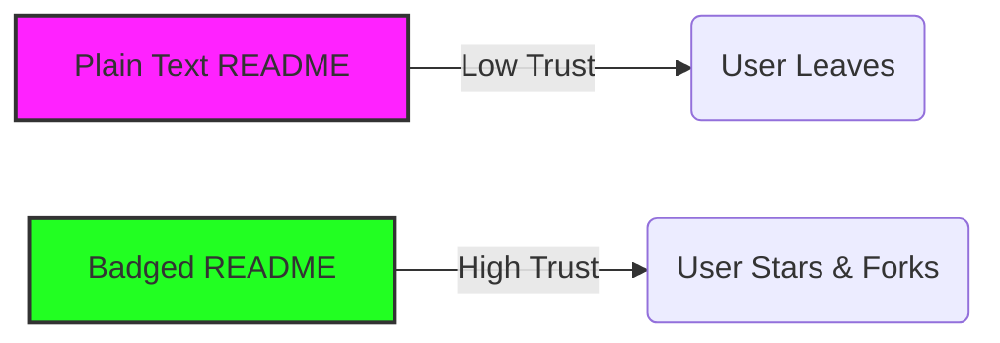
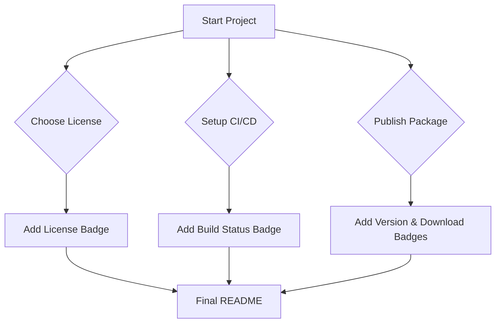

# 🛡️ The Ultimate README Badges Collection

> **The largest, cleanest, and most verifiable collection of README badges on the internet.**
>
> Now with **2000+ Badges** across 13 Categories! 🚀

 

**[🌐 Visit Web App](https://aliriyaj007.github.io/The-Ultimate-README-Badges-Collection/)** • **[📝 Contribute](./CONTRIBUTING.md)** • **[🐛 Report Issue](https://github.com/Aliriyaj007/The-Ultimate-README-Badges-Collection/issues)**

---

## 📖 Introduction

**The Ultimate README Badges Collection** is a curated, high-utility repository designed to solve a singular problem: **The time wasted searching for high-quality, reliable status badges.**

developers spend disproportionate hours hunting for the correct Markdown syntax to display build status, coverage, or tech stacks. This project centralizes that knowledge into a single, copy-paste-ready resource. It is not just a list; it is a standard for professional documentation status indicators.

## ⚡ Key Features

- **Massive Collection:** Over **2000+** badges covering every possible tech stack, service, and use case.
- **13 Categories:** Organized structure for Build, Testing, Social, Funding, Databases, and more.
- **Instant Search:** Powerful web app (`index.html`) using a massive local dataset to find badges in milliseconds.
- **Live Customizer:** Edit badge text, status, color, and style directly in the browser.
- **Consistent Styles:** All badges available in standard, flat-square, for-the-badge, and more.
- **Copy-Paste Ready:** Pre-formatted Markdown code for your project's README.

---

## ⚡ Why This Exists

Badges are more than decoration; they are **trust signals**. A repository without badges feels abandoned. A repository with broken or inconsistent badges feels amateur.

We exist to provide:
1.  **Immediacy:** Zero-configuration copy-paste blocks.
2.  **Consistency:** Uniform styles for professional presentation.
3.  **Reliability:** All badges are verified against active APIs.

### The Transformation

Before and after using professional badges:

---

## 🚀 Instant Usage (< 60 Seconds)

### Method 1: The "Search & Copy" (Fastest)

1.  Press `Ctrl + F` (or `Cmd + F`) on this page.
2.  Type the technology name (e.g., "React", "Docker", "License").
3.  Copy the Markdown block from the table.
4.  Paste into your `README.md`.

### Method 2: The Offline Web App 🆕

Included in this repository is a **single-file** web application (`index.html`) that allows you to browse, search, and customize badges offline.

1.  Open `index.html` in your browser.
2.  **Search** for badges instantly.
3.  **Customize** label, color, and style with the built-in editor.
4.  **Copy** the result directly to your clipboard.
5.  *Bonus:* Includes a **User Guide** and **Dark Mode**!

### Method 3: Browse by Category

| Category | Description |
| :--- | :--- |
| **[🏗️ Build & CI](./Categories/01-build-ci-status.md)** | GitHub Actions, Travis, CircleCI, Netlify |
| **[🧪 Testing & Coverage](./Categories/02-testing-coverage.md)** | Codecov, Jest, Cypress, SonarCloud |
| **[📦 Dependencies](./Categories/03-dependencies-version.md)** | NPM, PyPI, Node, Python, Dependabot |
| **[📚 Documentation](./Categories/04-documentation.md)** | ReadTheDocs, Wiki, GoDoc, Swagger |
| **[⚖️ License & Legal](./Categories/05-license-legal.md)** | MIT, Apache 2.0, GPL, Copyright |
| **[📉 Downloads & Stats](./Categories/06-downloads-analytics.md)** | Download counts, Hits, Docker Pulls |
| **[🚀 Deployment](./Categories/07-deployment-hosting.md)** | AWS, Google Cloud, Heroku, Vercel |
| **[💬 Social & Community](./Categories/08-social-community.md)** | Discord, Twitter, LinkedIn, YouTube |
| **[💸 Funding](./Categories/09-funding.md)** | GitHub Sponsors, Patreon, PayPal |
| **[⚙️ Custom & Other](./Categories/13-custom-other.md)** | Styling guides, "Made with", Fun badges |
| **[🥞 Development Stacks](./Categories/14-development-stacks.md)** | MERN, MEAN, LAMP, Jamstack, T3 Stack |
| **[💻 Languages & Frameworks](./Categories/11-languages-frameworks.md)** | React, Vue, Node.js, Python, Flutter |
| **[🗄️ Databases](./Categories/12-databases-services.md)** | Postgres, Mongo, Firebase, Supabase |
| **[📊 Repo Metadata](./Categories/10-repository-metadata.md)** | **50+ Status Badges**, Stars, Forks, Activity |

---

## 🏆 Top 50 Most Used Badges (Cheat Sheet)

For advanced power users, here are the absolute essentials for any serious repository.

### Status & Stats
| Name | Markdown |
| :--- | :--- |
| **Stars** | `` |
| **Forks** | `` |
| **Issues** | `` |
| **PRs** | `` |
| **License** | `` |
| **Contributors** | `` |
| **Last Commit** | `` |

### Tech Stack (Generic)
| Name | Markdown |
| :--- | :--- |
| **Python** | `` |
| **JavaScript** | `` |
| **TypeScript** | `` |
| **React** | `` |
| **Docker** | `` |

*(See specific [Tech Stack](./Categories/11-frameworks-tech-stack.md) category for hundreds more)*

---

## 🔄 Workflow Integration

How professional maintainers integrate these badges:

---

## 👨‍💻 Author & Contact

This project is maintained by **Riyajul Ali**, a passionate open-source contributor and developer.

**Connect for:**
*   Collaboration on Open Source tools.
*   Documentation strategy consulting.
*   Feedback on this repository.

---

## 🤝 Contributing

We believe in the power of community. If you find a broken badge or have a new one to add:

1.  **Fork** the repository.
2.  **Add** your badge to the correct category.
3.  **Submit** a formatted Pull Request.

*See [CONTRIBUTING.md](./CONTRIBUTING.md) for detailed guidelines.*

---

### If this collection saved you time, please consider starring ⭐ the repository.

*It helps others find these resources.*

